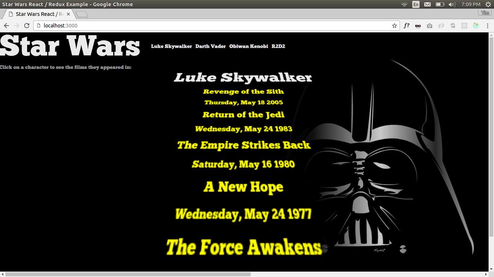

# Star Wars React/Redux Example
Set up a Redux Map State to Prop example. When you click a character, the application loads their bio data asynchonously and then loads the films data via a Promise, displaying characterData once all feeds are complete

## Installation and Startup
`npm install` 
`npm start` 
Go to http://localhost:3000/ in your browser

To run locally with webpack hot reloading (Development Mode)
`npm run dev`

## Preview
 
